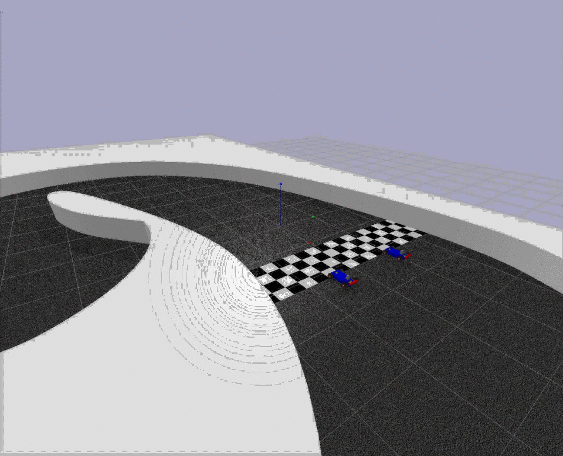
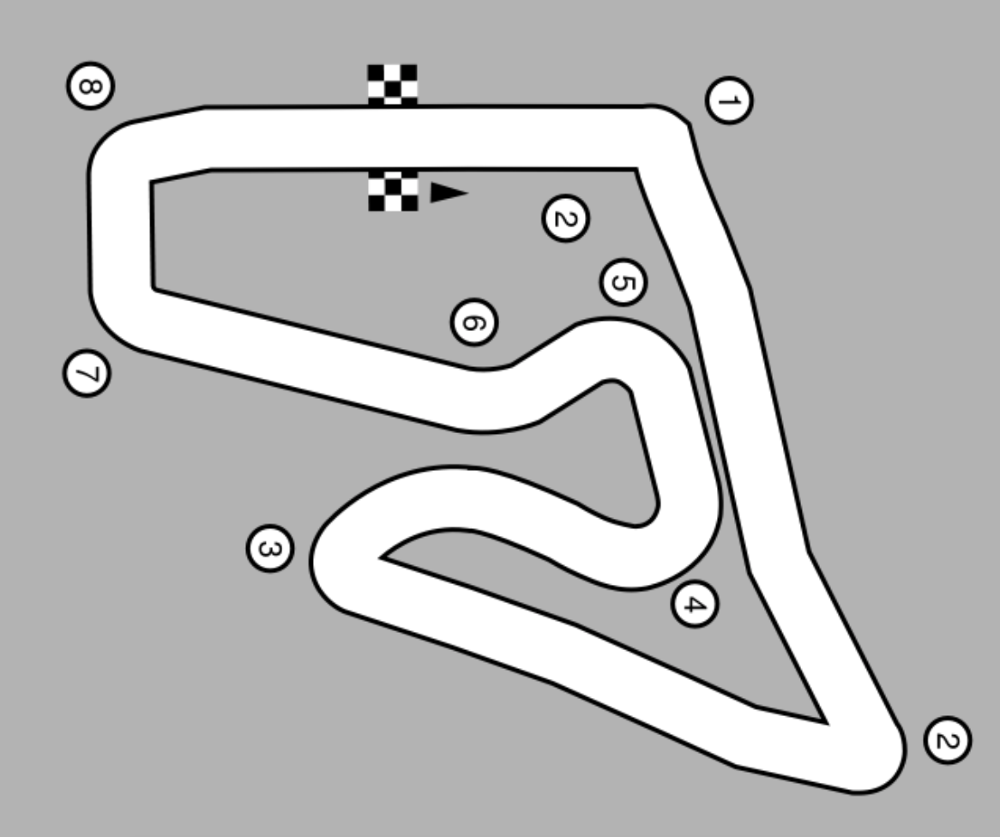
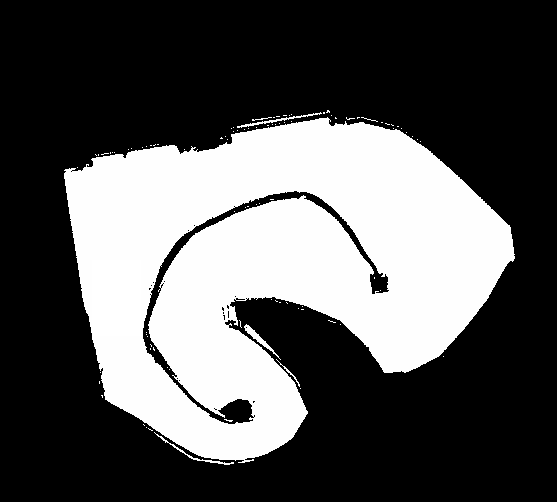
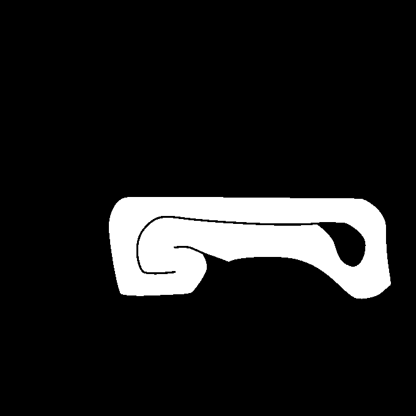
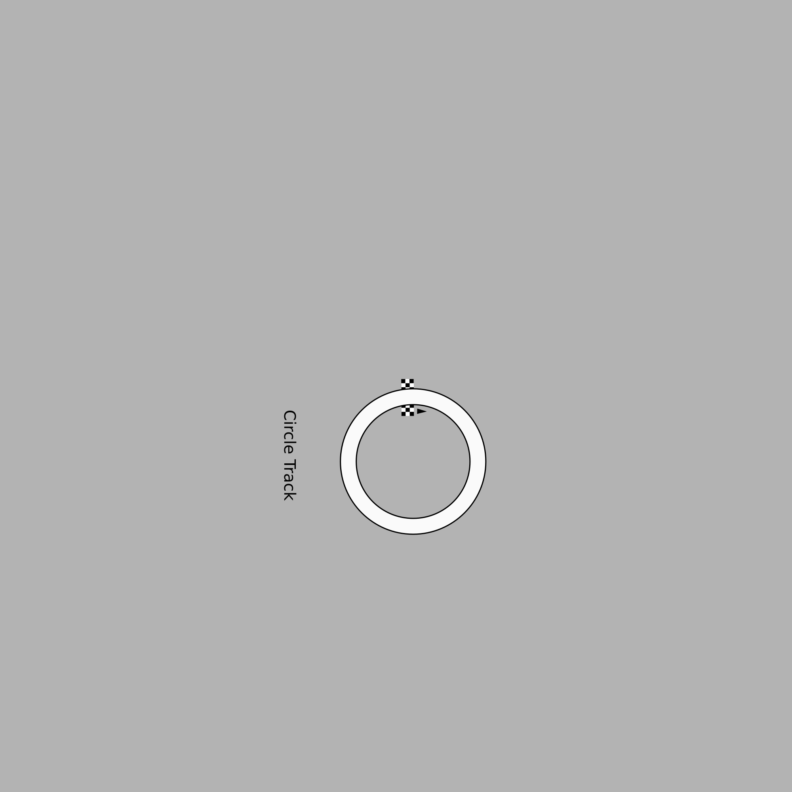
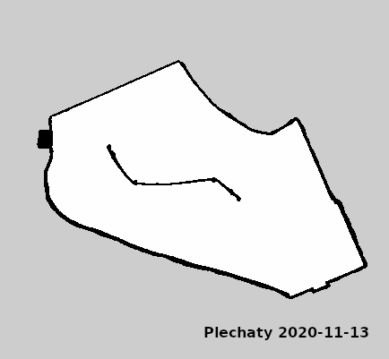

# Racecar Gym



A gym environment for a miniature racecar using the bullet physics engine with pybullet.
## Installation
You can install ``racecar_gym`` with the following commands:

```shell_script
git clone https://github.com/axelbr/racecar_gym.git
cd racecar_gym
pip install -e .
```

On the first use of this gym, the tracks are downloaded automatically.

Of course, you can download them manually too. Here is how you can do this from the command line:
```shell_script
cd ./models/scenes
VERSION=v1.0.0
wget https://github.com/axelbr/racecar_gym/releases/download/tracks-${VERSION}/all.zip
unzip all.zip
```


## Environments

The observation and action space is a `Dict` holding the agents and their id's. The observation and action space for a single agent 
is also a `Dict`, which is described in more detail below. In general, observations are obtained through sensors and commands
are executed by actuators. Vehicles can have multiple sensors and actuators. Those are described in the vehicle configuration
(e.g. [differential racecar](models/vehicles/racecar/racecar.yml)). Agents, which consist of a vehicle and an assigned task,
are specified in the scenario file (e.g. [austria.yml](scenarios/multi_austria.yml)). In this file, agents are described by the
sensors to use (note that they must be available in the vehicle configuration) and the corresponding task. Have a look at
[tasks.py](racecar_gym/core/tasks.py) to see all available tasks.

**Example:**
```yaml
world:
  name: austria
agents:
  - id: A
    vehicle:
      name: racecar
      sensors: [lidar, pose, velocity, acceleration]
      color: blue # default is blue, one of red, green, blue, yellow, magenta or random
    task:
      task_name: maximize_progress
      params: {laps: 1, time_limit: 120.0, terminate_on_collision: False}
```

This example specifies a scenario on the [Austria](models/scenes/austria/austria.yml) track.
One agent with id **A** is specified. The agent controls the differential drive racecar defined in [differential racecar](models/vehicles/racecar/racecar.yml), identified by its name.
The scenario tells the agent to use only the specified sensors (lidar, pose, velocity, acceleration). 
Optionally, one can also specify a color for the car. The default color is blue. Available colors are listed above.

The task which is assigned to this agent is also identified by name (implementations can be found in [tasks.py](racecar_gym/core/tasks.py)). Task parameters are passed by the dict *params*.

### Observations

Observations are obtained by (possibly noisy) sensors. Parameters for the sensors as well as the level of noise, can be
configured in the corresponding vehicle configuration (e.g.  [differential racecar](models/vehicles/racecar/racecar.yml)). 
In the scenario specification, one can specify which of the available  sensors should be actually used. 
The observation space is a dictionary where the names of the sensors are the keys 
which map to the actual measurements. Currently, five sensors are implemented:
pose, velocity, acceleration, LiDAR and RGB Camera. Further, the observation space also includes the current simulation time.

|Key|Space|Defaults|Description|
|---|---|---|---|
|pose|`Box(6,)`| |Holds the position (`x`, `y`, `z`) and the orientation (`roll`, `pitch`, `yaw`) in that order.|
|velocity|`Box(6,)`| |Holds the `x`, `y` and `z` components of the translational and rotational velocity.|
|acceleration|`Box(6,)`| |Holds the `x`, `y` and `z` components of the translational and rotational acceleration.|
|lidar|`Box(<scans>,)`|`scans: 1080`|Lidar range scans.|
|rgb_camera|`Box(<height>, <width>, 3)`|`height: 240, width: 320`|RGB image of the front camera.|

### Actions
The action space for a single agent is a defined by the actuators of the vehicle. For instance, [differential racecar](models/vehicles/racecar/racecar.yml)
defines two actuators: motor and steering. The action space is therefore a dictionary with keys `motor` and `steering`.
Note, that the action space of the car is normalized between -1 and 1.
The complete action space for this vehicle looks like this:

|Key|Space|Description|
|---|---|---|
|motor|`Box(low=-1, high=1, shape=(1,))`|Throttle command. If negative, the car accelerates backwards.|
|steering|`Box(low=-1, high=1, shape=(1,))`|Normalized steering angle.|

### State
In addition to observations obtained by sensors, the environment passes back the true state of each vehicle in each
step (the state is returned as the *info* dictionary). The state is a dictionary, where the keys are the ids of all agents.
Currently, the state looks like this:

|Key|Type|Description|
|---|---|---|
|wall_collision|`bool`|True if the vehicle collided with the wall.|
|opponent_collisions|`List[str]`|List of opponent id's which are involved in a collision with the agent.|
|pose|`NDArray[6]`|Ground truth pose of the vehicle (x, y, z, roll, pitch, yaw).|
|acceleration|`NDArray[6]`|Ground truth acceleration of the vehicle (x, y, z, roll, pitch, yaw).|
|velocity|`NDArray[6]`|Ground truth velocity of the vehicle (x, y, z, roll, pitch, yaw).|
|progress|`float`|Current progress in this lap. Interval: [0, 1]|
|time|`float`|Simulation time.|
|checkpoint|`int`|Tracks are subdivided into checkpoints to make sure agents are racing in clockwise direction. Starts at 0.|
|lap|`int`|Current lap.|
|rank|`int`|Current rank of the agent, based on lap and progress.|
|wrong_way|`bool`|Indicates wether the agent goes in the right or wrong direction.|
|observations|`Dict`|The most recent observations of the agent.
## Scenes

Currently four maps are available. Each scenario is also available with a GUI
server. To launch the rendering window, you can append '*_Gui*' to the environment name (e.g. *MultiAgentTrack1-v0* vs *MultiAgentTrack1_Gui-v0*).


| Image | Name |
| --- | --- |
||`MultiAgentAustria-v0`, `SingleAgentAustria-v0`|
||`MultiAgentBerlin-v0`, `SingleAgentBerlin-v0`|
||`MultiAgentMontreal-v0`, `SingleAgentMontreal-v0`|
||`MultiAgentTorino-v0`, `SingleAgentTorino-v0`|
||`MultiAgentCircle_cw-v0`, `MultiAgentCircle_ccw-v0`, `SingleAgentCircle_cw-v0`, `SingleAgentCircle_ccw-v0`|
||`MultiAgentPlechaty-v0`, `SingleAgentPlechaty-v0`|

Scenarios can also be customized. Have a look at the examples.

## Notes
Please note that this is work in progress, and interfaces might change. Also more detailed documentation and additional scenarios will follow.
