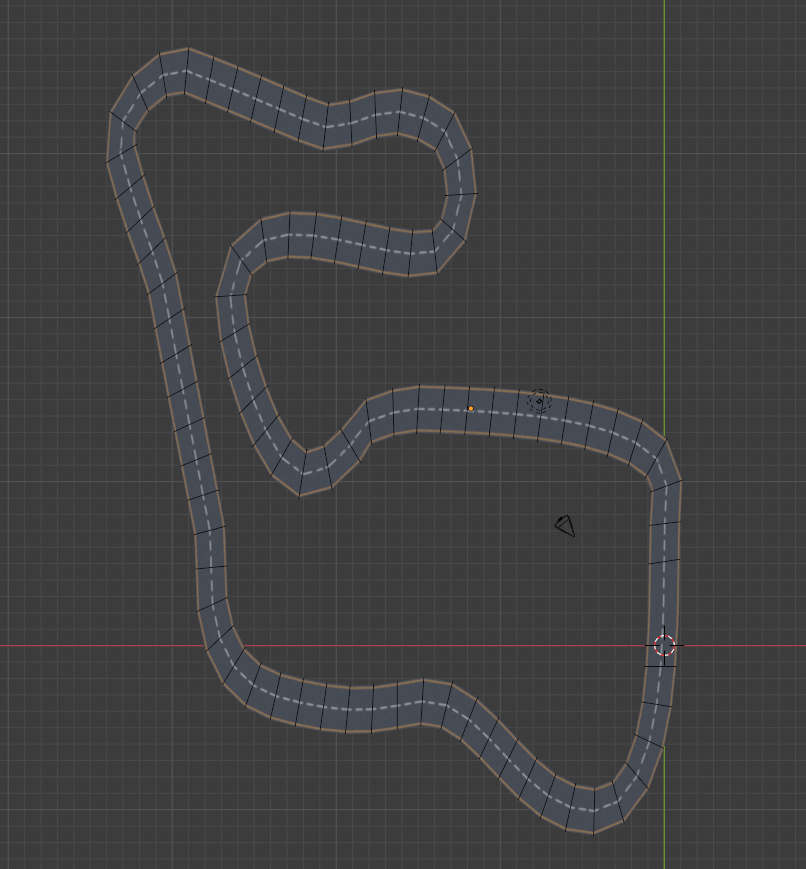
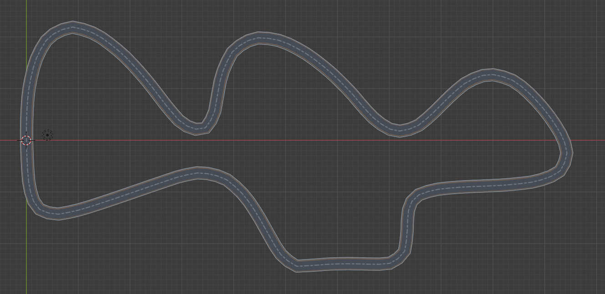

# Racecar Gym


A gym environment for a miniature racecar using the bullet physics engine with pybullet.
## Installation
You can install ``racecar_gym`` with the following commands:

```shell_script
git clone https://github.com/axelbr/racecar_gym.git
cd racecar_gym
pip install -e .
```

## Environments

The observation and action space is a `Dict` holding the agents and their id's. The observation and action space for a single agent 
is also a `Dict`, which is described in more detail below. In general, observations are obtained through sensors and commands
are executed by actuators. Vehicles can have multiple sensors and actuators. Those are described in the vehicle configuration
(e.g. [differential racecar](models/vehicles/racecar/racecar.yml)). Agents, which consist of a vehicle and an assigned task,
are specified in the scenario file (e.g. [austria.yml](scenarios/austria.yml)). In this file, agents are described by the
sensors to use (note that they must be available in the vehicle configuration) and the corresponding task. Have a look at
[tasks.py](racecar_gym/core/tasks.py) to see all available tasks.

**Example:**
```yaml
world:
  name: austria
  start_positions: index
agents:
  - id: A
    vehicle:
      name: racecar
      sensors: [lidar, pose, velocity, acceleration]
    task:
      task_name: maximize_progress
      params: {laps: 1, time_limit: 120.0, terminate_on_collision: False}
```

This example specifies a scenario in the [Austria](models/scenes/austria/austria.yml) map. Also, you can specify the way 
how agents spawn. Using the *index* policy, agents will start on a fixed position, depending on their declaration order in
the scenario. Using *random*, agents will spawn randomly on the track.

Furthermore, one agent with id **A**
is specified. The agent controls the differential drive racecar defined in [differential racecar](models/vehicles/racecar/racecar.yml),
identified by its name. The task which is assigned to this agent is also identified by name (implementations can be found in [tasks.py](racecar_gym/core/tasks.py)).
Task parameters are passed by the dict *params*.

### Observations

Observations are obtained through sensors. Each agent specifies which sensor to use. The observation space is a dictionary
where the names of the sensors are the keys which map to the actual measurements. Currently, five sensors are implemented:
GPS, IMU, Tachometer, LiDAR and RGB Camera. Further, the observation space also includes the current simulation time.

|Key|Space|Defaults|Description|
|---|---|---|---|
|pose|`Box(6,)`| |Holds the position (`x`, `y`, `z`) and the orientation (`roll`, `pitch`, `yaw`) in that order.|
|velocity|`Box(6,)`| |Holds the `x`, `y` and `z` components of the translational and rotational velocity.|
|acceleration|`Box(6,)`| |Holds the `x`, `y` and `z` components of the translational and rotational acceleration.|
|lidar|`Box(<scans>,)`|`scans: 1080`|Lidar range scans.|
|rgb_camera|`Box(<height>, <width>, 3)`|`height: 240, width: 320`|RGB image of the front camera.|
|time|`Box(1,)`| |Current simulation time.|

### Actions
The action space for a single agent is a defined by the actuators of the vehicle. For instance, [differential racecar](models/vehicles/racecar/racecar.yml)
defines two actuators: motor and steering. The action space is therefore a dictionary with keys `motor` and `steering`.

The complete action space for this vehicle looks like this:

|Key|Space|Defaults|Description|
|---|---|---|---|
|motor|`Box(2,)`| |Motor command consisting of the target speed and the force to apply.|
|steering|`Box(1,)`| |Steering angle.|

### State
In addition to observations obtained by sensors, the environment passes back the true state of each vehicle in each
step (the state is returned as the *info* dictionary). The state is a dictionary, where the keys are the ids of all agents.
Currently, the state looks like this:

|Key|Type|Description|
|---|---|---|
|collision|`bool`|Whether the vehicle is in a collision with another agent or the wall.|
|section|`int`|Current section passed by the vehicle.|
|section_time|`float`|Simulation time when the vehicle entered the current section.|
|lap|`int`|Current lap in which the vehicle is.|
|time|`float`|Simulation time.|

## Scenes

Currently two maps are available and a total of four scenarios are specified. Each scenario is also available with a GUI
server. To launch the rendering window, you can append '*_Gui*' to the environment name (e.g. *MultiAgentTrack1-v0* vs *MultiAgentTrack1_Gui-v0*).


| Image | Name |
| --- | --- |
||`MultiAgentAustria-v0`|
||`MultiAgentTrack1-v0`|
## Notes
Please note that this is work in progress, and interfaces might change. Also more detailed documentation and additional scenarios will follow.
