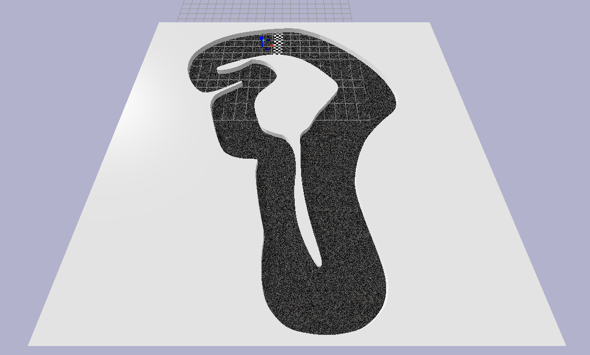

# Racecar Gym


A gym environment for a miniature racecar using the bullet physics engine with pybullet.
## Installation
Clone the repository.
You can install ``racecar_gym`` with the following commands:

```shell_script
git clone https://github.com/axelbr/racecar_gym.git
cd racecar_gym
pip install -e .
```

## Environments

The observation space is a `n-tuple` of `Dict`, where `n` is the number of agents. An observation for a single agent has the following form.

|Key|Space|Defaults|Description|
|---|---|---|---|
|pose|`Box(6,)`||Holds the position (`x`, `y`, `z`) and the orientation (`roll`, `pitch`, `yaw`) in that order.|
|velocity|`Box(6,)`||Holds the translational velocity (`x`, `y`, `z`) and the rotational velocity around the `x`, `y` and `z` axis, in that order.|
|lidar|`Box(<scans>,)`|`scans: 100`|Lidar range scans.|
|lap|`Discrete(<laps>)`|`laps: 2`|The current lap of the vehicle. `laps` is a parameter for the simulation.|
|time|`Box(6,)`||Passed time since the start of the race.|
|collision|`Discrete(2)`||Indicates if an agent is involved in a collision with the wall or an opponent.|

Currently two maps are available and a total of four scenarios are specified.

| Image | Name | Description |
| --- | --- | --- |
||`f1tenth-berlin-two-gui-v0`|A head to head race on the berlin track (original course from [F1Tenth Berlin Grand Prix](https://www.ifac2020.org/program/competitions/f1tenth-autonomous-grand-prix/)) with rendering enabled.|
||`f1tenth-berlin-two-v0`|The same scenario as in `f1tenth-berlin-two-gui-v0`, but without GUI.|
||`f1tenth-porto-two-gui-v0`|A head to head race on the porto track (from the [F1Tenth Race Day in Porto](https://f1tenth.org/race.html)) with rendering enabled.|
||`f1tenth-porto-two-v0`|The same scenario as in `f1tenth-porto-two-gui-v0`, but without GUI.|

## Notes
Please note that this is work in progress, and interfaces might change. Also more detailed documentation and additional scenarios will follow.
